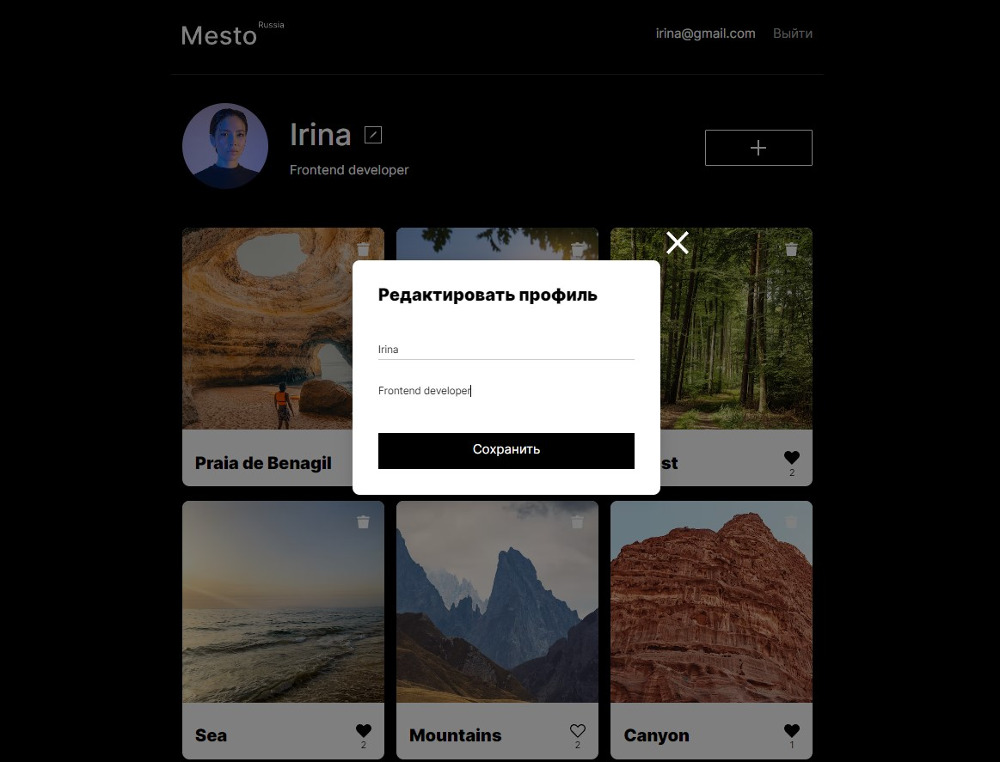
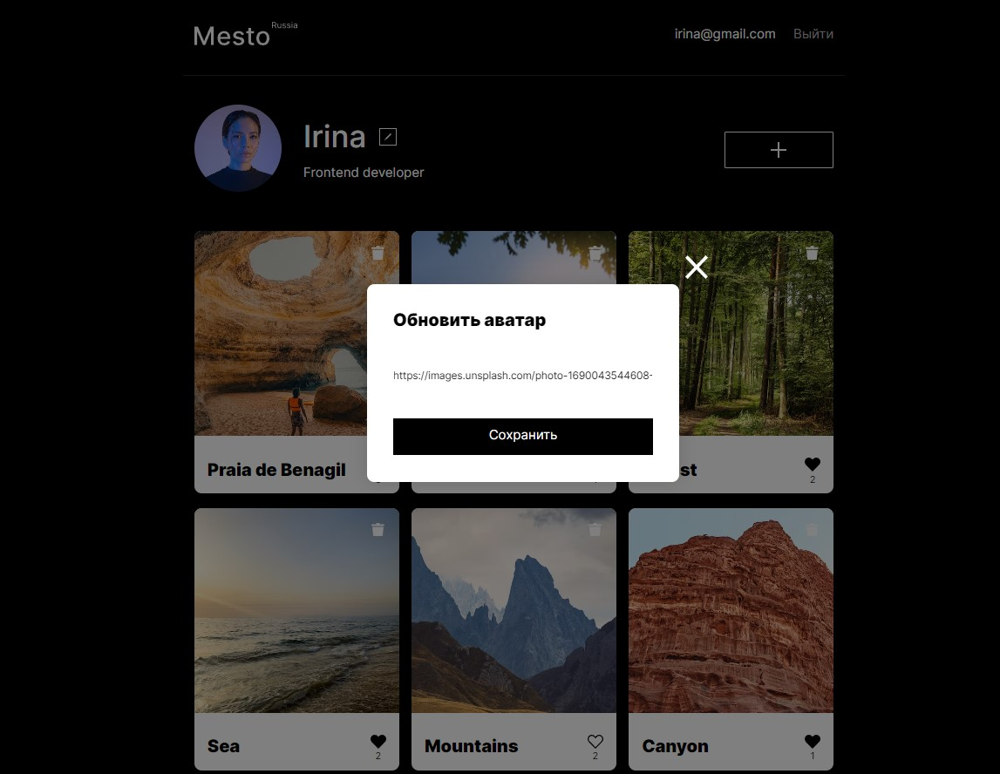
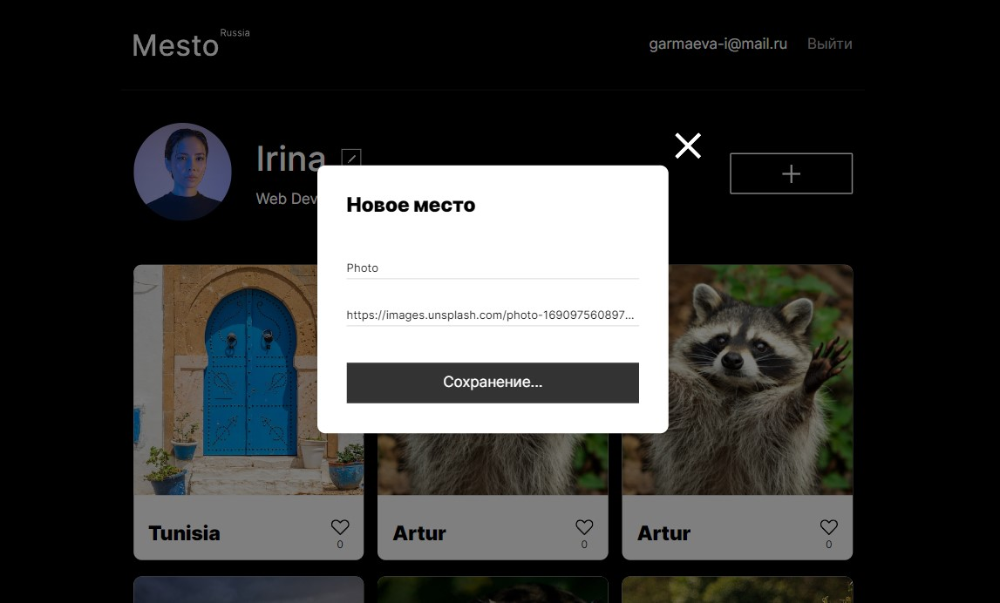
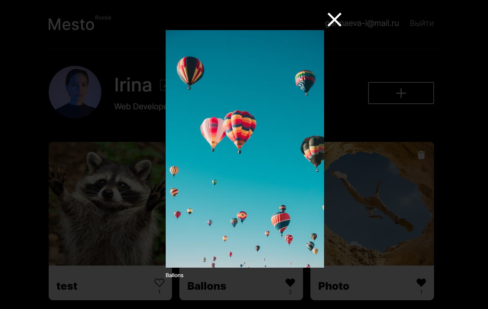

# Edicational purpose project "Mesto" on React from [Yandex Practicum](https://practicum.yandex.ru/) Web-developer course.

## Description

Project `Mesto` is an interactive responsive page where users can share photos, delete and like them, change user information and avatar. Forms are validated on the client side.
The goal of the project is to solidify knowledge in:
* JSX
* Declarative approach
* Functional components
* React hooks

[Deploy](https://mesto-react-steel.vercel.app/)

## Functionality

* Edit user data
* Update avatar
* Add a new card
* Put and remove likes (including like counter)
* Modal window with an enlarged photo of the card
* Delete a card created by the user with a confirmation modal window

## Technologies
* HTML
* BEM
* CSS
* Flexbox
* GRID
* React JS
* Webpack

## Screenshots

<b>Show all</b>

## Usage
Clone repository:

  `git clone git@github.com:IrinaGarmaeva/mesto-react.git`

Install dependencies:

  `npm install`

Run app:

  `npm run start`

## Figma design

### [Макет Figma 1](https://www.figma.com/file/2cn9N9jSkmxD84oJik7xL7/JavaScript.-Sprint-4?node-id=0%3A1)
### [Макет Figma 2](https://www.figma.com/file/bjyvbKKJN2naO0ucURl2Z0/JavaScript.-Sprint-5?node-id=0-1&t=2IBiYuzBJASdL3j4-0)
### [Макет Figma 3](https://www.figma.com/file/kRVLKwYG3d1HGLvh7JFWRT/JavaScript.-Sprint-6?node-id=0-1&t=dDAEaAH6jCRnbhd8-0)
### [Макет Figma 4](https://www.figma.com/file/PSdQFRHoxXJFs2FH8IXViF/JavaScript.-Sprint-9?type=design&node-id=0-1)

